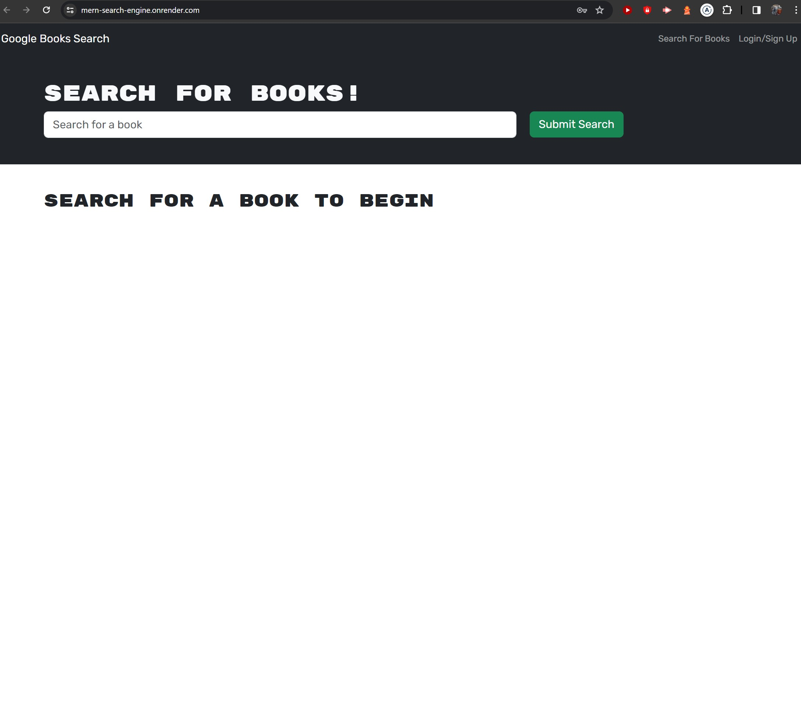

# Book Search Engine Starter Code

## Description

This project is a full-stack application built using the MERN stack (MongoDB, Express.js, React, and Node.js). It's a search engine for books, allowing users to search, save, and delete books from their reading list.

## Table of Contents

- [Installation](#installation)
- [Features](#features)
- [Usage](#usage)
- [Deployment](#deployment)
- [Screenshots](#screenshots)
- [License](#license)
- [Contact](#contact)

## Features

- User authentication (signup/login)
- Search for books using a third-party API
- Save books to a personal reading list
- View and manage saved books


## Installation

1. Clone the repo:
```
git clone https://github.com/Julian-A-Mort/MERN-Search-Engine
```

2. install the necessary dependencies (in both root, server and client directories)
```
npm install
```

3. Start the server (in the root directory)

```
npm run start-dev
```

## Usage
After starting the application:

Visit http://localhost:3000 to view the client application.
Use the search bar to search for books.
Sign up/Log in to save books to your personal reading list.
View and delete books from your reading list.

## Deployment
Deployed using Render with compatability in mind.

## Screenshots


## License
This project is not currently under any license. Feel free to use as you wish.

## Contact
If you have any questions about this repo, then please open an issue or contact me on GitHub at [Julian-A-Mort] (https://github.com/Julian-A-Mort) 